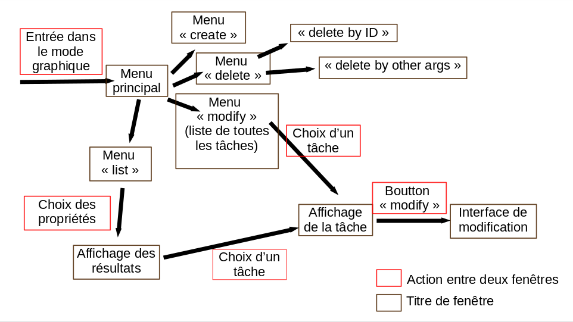
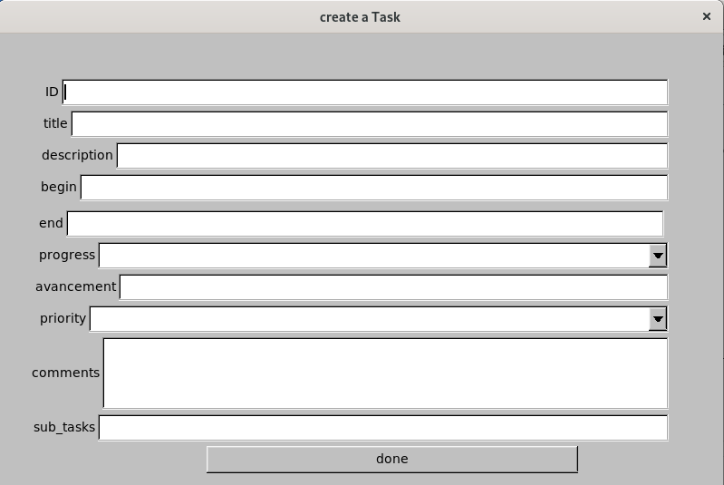
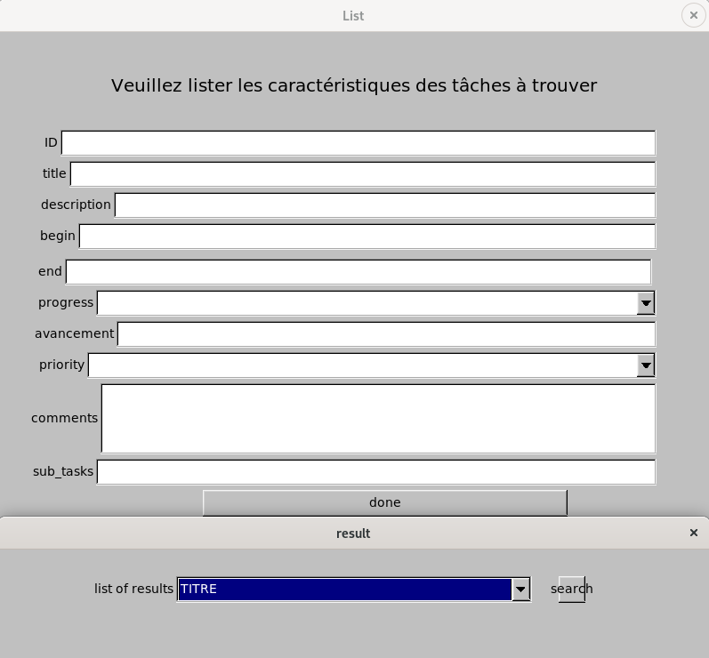

# TDL

Ce projet vise à fournir une interface pratique pour gérer sa "to do list" depuis son ordinateur.

Deux modes de fonctionnement son prévus : mode console et mode graphique.

# Mode Console 

Dans ce mode tout se gère depuis la console. Le principe de fonctionnement est simple : vous entrez les instructions à la suite et l'interface les traites une à une. Les différents arguments et valeurs doivent être entrés.

Vous verrez affiché l'instruction suivante : " instruct >"" et vous entrerez votre fonction et ses arguments à la suite. Vous appuyerez sur la touche ENTREE. L'instruction se lancera et vous pourrez en effectuer une à la suite. 

## Entrer des instructions

Afin de vous faire comprendre de l'API vous devez suivre un protocole. Le premier mot que vous entrez doit être la fonction que vous voulez éxécuter. A la suite vous pouvez mettre les arguments de votre fonction, repérés par des '--' avant l'argument. Par exemple si un argument est le titre vous mettrez '--title'. Après un argument l'API lira ses valeurs, et passera à l'argument suivant en lisant la prochaine occurence des caractères '--'. 

### Différent arguments

- title : repère le titre
- description : repère la description
- begin : repère le début de la tâche
- end : repère la fin de la tâche
- progress : repère le progrès de la tâche. Les valeurs compatibles avec cet argumement sont 0 pour une tâche ouverte (Open), 1 pour une tâche en progrès (In-Progress) et 2 pour une tâche fermée (Closed).
- avancement : repère l'avancement de la tâche. Les valeurs compatibles avec cet argument sont les entiers
- priority : repère la priorité de la tâche. Comme pour le progrès les valeurs compatibles sont 0 pour une priorité faible (Low), 1 pour normale (Normal), 2 pour haute (High) et 3 pour super haute (Super-High).
- comments : repère les commentaires. Pour séparer deux commentaires il faut mettre le caractère '^'.
- under : donne les IDs des sous tâches de cette tâche.

Par défault, une tâche prend les valeurs suivantes: 
- Titre : Pas de titre
- Description : Pas de description
- date de début et de fin : date actuelle
- progrès : Ouvert
- avancement : 0%
- priorité : Normal
- commentaires : vide
- sous-tâches : vide

## Utilisation des fonctionnalités

4 fonctionnalités sont disponibles : créer, modifier, faire une liste, supprimer.

### Créer

Pour créer une nouvelle tâche, vous devez entrer le mot "create" au début de votre instruction.
Ensuite vous pouvez énumerer les caractéristiques que vous voulez de la façon suivante:
 "--arg valeur --arg valeur ...". 
 
 Par exemple "create --title TITRE --priority High" créera une tâche ayant pour titre TITRE et pour priorité Haute.
 
 Les arguments non renseignés sont remplis automatiquement par l'interface, vous n'avez pas à vous soucier de cela.
Pour créer une tâche standard vous pouvez donc écrire "create".

### Faire une liste

Vous aurez besoin de faire des listes de tâches vérifiant des propriétés communes, par exemple toutes les tâches ayant une priorité Haute.

L'interface permet cela, avec le mot clef "list". En entrant "list" au début de votre instruction, l'interface comprendra votre intention, et les arguments que vous mettrez à la suite seront utilisés pour déterminer si une tâche sera affichée ou non.

Par exemple : "list --priority High" affichera toutes les tâches ayant une priorité Haute.

### Supprimer

Vous pourrez supprimer une ou plusieurs tâches à la fois. Pour cela, la démarche est similaire aux deux dernières fonctionnalités : le mot clef est "remove" et les arguments utilisés ensuite seront utilisés pour détruire les tâches correspondant à ces critères. 

Le meilleur moyen de supprimer une tâche en particulier est de donner son identifiant, récupéré grâce à la fonctionnalité "list". Vous pourrez par exemple supprimer la tâche ayant l'identifiant 13 en entrant "remove --ID 13"

Autre exemple : "remove --priority Low" supprimera toutes les tâches ayant un faible priorité

### Modifier

Vous pouvez modifier des tâches pré-existantes. Pour cela, la démarche est légèrement différente par rapport aux autres fonctionnalités. Le mot clef est "modify" et les arguments entrés permettent à l'interface de cibler les tâches à modifier.

Pour que l'interface connaisse les changements à effectuer, il faut cependant donner plus d'arguments : ces arguments seront les mêmes que ceux utilisés précédemment, en ajoutant un "m" à la fin du mot.

Par exemple : on écrira "--titlem TITRE2" si on veut que les tâches sélectionnées voient leur titre modifié en TITRE2.

Exemple complet : "modify --begin 15/2/2020 --beginm 15/4/2020 --descriptionm tâche reportée" modifiera toutes les tâches commençant le 15 février 2020 en des tâches commençant le 15 Avril 2020 avec une description "tâche reportée".

# Mode Graphique

Le mode graphique utilise les fonctions définies dans le mode console et apporte une interface graphique supplémentaire. On y retrouve donc les mêmes fonctionnalités. Voici un graphe des différentes parties de l'interface que vous verrez :

On retrouve donc les mêmes fonctionnalités que le mode console. 

### Créer

Pour créer une nouvelle tâche depuis le menu principal, cliquer sur l'icône "Create Task", puis entrer les paramètres que vous désirez. L'interface vous forcera à mettre un nombre dans la partie "avancement", et pour différentier deux commentaires vous pouvez faire un saut de ligne

Lorsque vous avez fini, cliquez sur "done" et fermer la fenêtre, vous tâche est enregistrée !

### Faire une liste

Pour faire une liste de tâche vérifiant des propriétés communes, cliquez sur l'icône "List Tasks" dans le menu principal. Vous serez alors invité à entrer les paramètres qui vous intéressent, et lorsque vous aurez fini vous cliquerez sur "done".

Ensuite une autre fenêtre s'ouvrira et vous pourrez visualiser les tâches vérifiant vos conditions. Pour visualiser une tâche, il suffit de cliquer sur son nom dans la liste déroulante que vous verrez, puis de cliquer sur le bouton "search", vous verrez alors les informations sur votre tâche.

### Supprimer

Dans ce mode, vous pouvez supprimer une tâche directement en récupérant son identifiant, ou bien supprimer plusieurs tâches en même temps. Pour cela, cliquer dans le menu principal sur le bouton "Delete Existing Task", puis sur "Delete by ID" ou "Delete by other elements".

- Delete by ID : une petit fenêtre s'ouvre, vous pouvez entrer l'identifiant de la tâche et cliquer sur "done". La tâche est alors effectivement supprimée. 
- Delete by other elements : De même, une fenêtre s'ouvre et vous êtes invités à remplir les champs qui vous intéressent. Il suffit ensuite de cliquer sur le bouton "done"

### Modifier

Pour modifier une tâche, il faut tout d'abord cliquer sur le bouton "Modify Existing Task". Une fenêtre avec une liste déroulante s'ouvre alors : c'est la liste de toutes les tâches enregistrées. Il vous suffit alors de choisir la tâche ayant le titre qui vous intéresse, et de cliquer dessus. Ses informations s'ouvrent et vous pouvez cliquer sur le bouton "modiify".

Une dernière fenêtre s'ouvre alors, vous proposant de modifier les champs de votre choix. Lorsque vous avez fini, cliquez sur "done", et l'interface vous ramène au menu principal.
